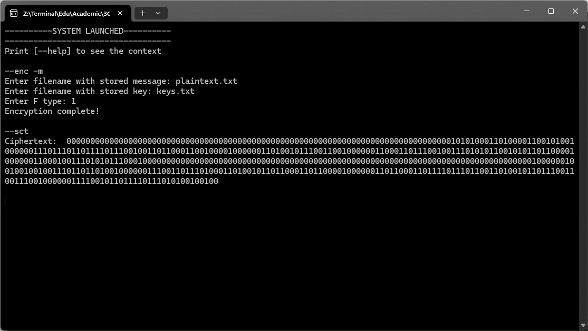

# Блочное шифрование

Данная программа шифрует и дешифрует сообщения по алгоритму сети Фейстеля. *Полный листинг программы см. в файле* `feistel.py`

Основные действия функций записаны в документации к каждой функции *см. в файле* `feistel.py`

### Пример работы программы

Используемые команды в программе

Пример шифрования сообщения из файла: 
+ Открытый текст хранится в файле `plaintext.txt`
+ Ключи находятся в файле `keys.txt`

Содержимое файла `plaintext.txt`
```txt
The world is cruel but I'm still loving you!
```

Содержимое файла `keys.txt`

```txt
1001
1100
```


