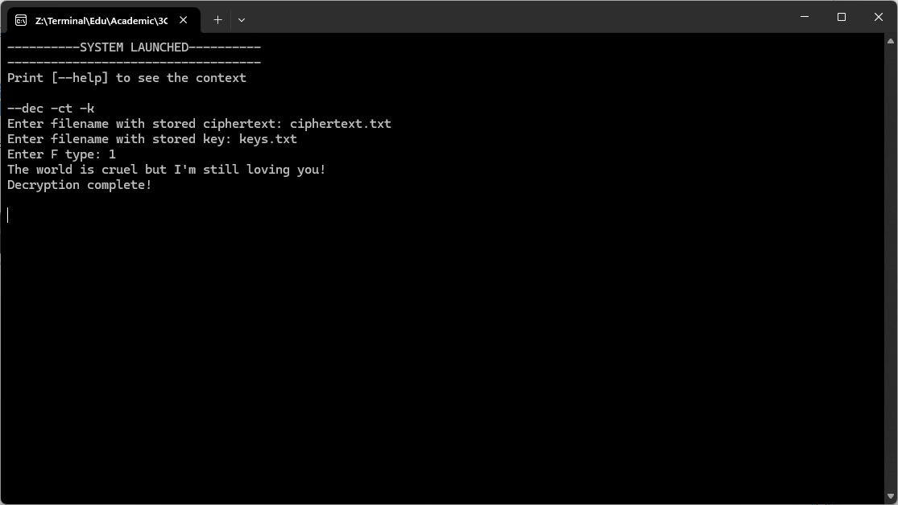

# Блочное шифрование

Данная программа шифрует и дешифрует сообщения по алгоритму сети Фейстеля. *Полный листинг программы см. в файле* `feistel.py`

Основные действия функций записаны в документации к каждой функции *см. в файле* `feistel.py`

Рассмотрим основные блоки программы:

Функция проводит побитовый $\oplus$ двух входящий битовых последовательностей. Также функция дополняет длину блоков до ближайшей степени 2, если необходимо

```python
def xor(s1, key):
    """
    Функция выполняет операцию XOR с двумя двоичными строками.
    Args:
    s1: Первая двоичная строка.
    key: Вторая двоичная строка.
    Returns:
    Строка, содержащая результат операции XOR.
    """
    if len(s1) != len(key):
        max_len = max(len(s1), len(key))
        # raise ValueError("Длина строк не совпадает")
        block_size = 2**int(math.ceil(math.log2(max_len)))
        s1 = s1.zfill(block_size)
        key = key.zfill(block_size)
    result = ""
    for i in range(len(s1)):
        result += str(int(s1[i]) ^ int(key[i]))
    return result
```

<br>

Функция зашифровывает входящие битовые последовательности при помощи ключей и номера функции, согласно алгоритму Фейстеля. Эта же функция используется для дешифровки шифртекста, требуется предваритиельно воспользоваться функцией `def reverse(...)` для смены порядка применения ключей

```python
def encrypt(bin_list, keys, rounds, f_type):
  """
  Шифрует текст с помощью сети Фейстеля.
  Args:
    plaintext: Текст для шифрования (строка).
    key: Ключ шифрования (строка).
    rounds: Количество раундов (целое число).
    f_type: Тип функции f (0 - единичная, 1 - XOR) (целое число).
  Returns:
    Зашифрованный текст (строка).
  """
  if len(bin_list) % 2 != 0: bin_list.append('00000000')
  plaintext = ''.join(bin_list)
  l, r = plaintext[:len(plaintext) // 2], plaintext[len(plaintext) // 2:]
  if rounds < 3: rounds = 3
  for i in range(rounds):
    if f_type == 0:
        print(i)
        l_temp = l
        r_temp = r
        r = l
        l = xor(l_temp, r_temp)
    elif f_type == 1:
        l_temp = l
        r_temp = r
        r = l_temp
        l = xor(l_temp, keys[i % len(keys)])
        l = xor(l, r_temp)
    else:
      raise ValueError("Неверный тип функции f")
  return l + r
```

---

<br>

### Пример работы программы

**Используемые команды в программе**


**Пример шифрования сообщения из файла:**

+ Открытый текст хранится в файле `plaintext.txt`
+ Ключи находятся в файле `keys.txt`
+ Результат шифрования записывается в файл `ciphertext.txt`

Содержимое файла `plaintext.txt`
```txt
The world is cruel but I'm still loving you!
```

Содержимое файла `keys.txt`

```txt
1001
1100
```


**Пример дешифровки зашифрованного сообщения**
+ Шифр текст хранится в файле `ciphertext.txt`
+ Ключи находятся в файле `keys.txt`
+ Результат дешифрования записывается в файл `decrypted.txt`


