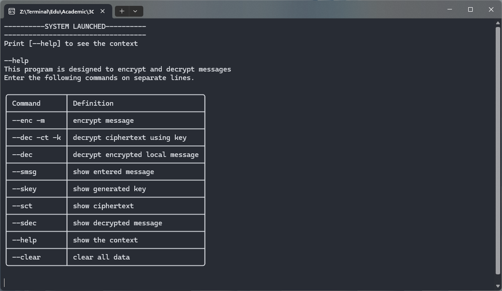
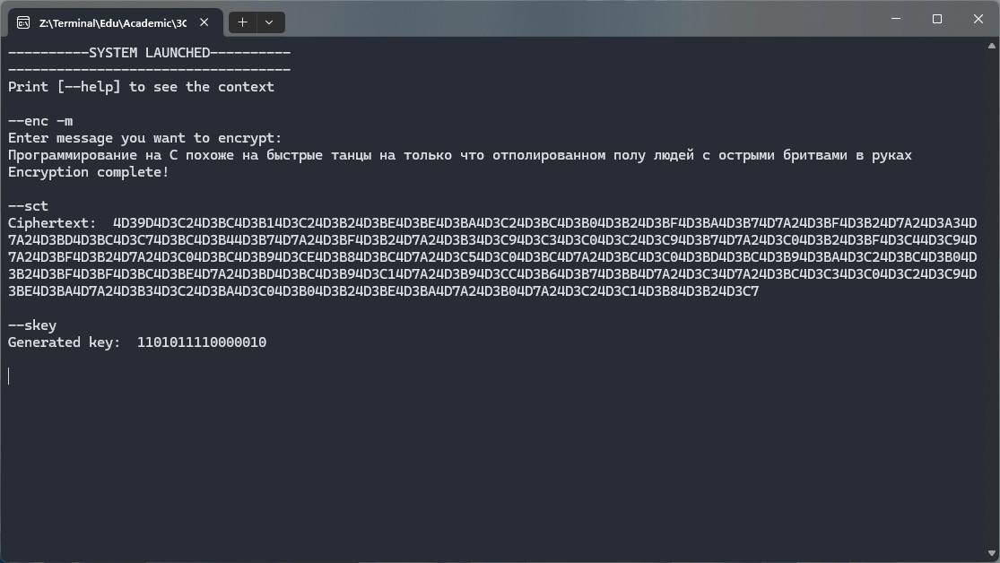
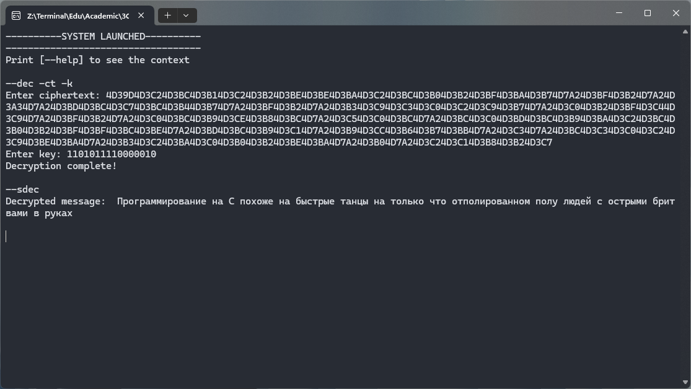

# Симметричные криптосистемы 

### Программа алгоритма Вернама

Приложение `Vernam` предназначено для шифрования и расшифрования сообщений и работает по алгоритму Вернама. Программа может работать на разных компьютерах. 

**Преимущества** Пользователь может ввести сообщение и зашифровать его с помощью встроенных команд. Затем отправить шифр текст и ключ другому пользователю, который в свою очередь на собственном пк воспользуется программой для расшифрования сообщения. Приложение работает на устройствах с OS Windows и Unix-подобных OS.

**Недостатки** Если ввести в поле ввода какой-либо команды данные неподходящего формата, то программа "вылетит"

Рассмотрим используемые функции: 

1. Поступающее на вход сообщение преобразуется в битовую последовательность согласно представлению каждого символа в кодировке `UTF-8`

```python
def get_0b_text(text: str):
    binary_text = list()
    for char in text:
        hex_representation = hex(ord(char))[2:]
        binary_representation = bin(int(hex_representation, 16))[2:].zfill(len(hex_representation)*4)
        binary_text.append(binary_representation)
    return binary_text
```

2. Генерируется случайным образом ключ, для шифрования и расшифрования

```python
def generate_key():
    gamma = ''
    binary_number = ""
    for _ in range(12):
        bit = random.randint(0, 1)
        binary_number += str(bit)
    gamma += binary_number
    return gamma
```

3. Следующая функция принимает на вход полученную битовую последоватаельность каждого символа полученного сообщения и с помощью операции $\oplus$ - `xor` выдае `двоичное представление шифртекста`


```python
def encrypt(data, key):
    encrypted_data = []
    for binary_string in data:
        encrypted_string = ''
        for i in range(len(binary_string)):
            encrypted_bit = str(int(binary_string[i]) ^ int(key[i % len(key)]))
            encrypted_string += encrypted_bit
        encrypted_data.append(encrypted_string)
    return encrypted_data
```

4. Следующая функция расшифровывает полученнную битовую последовательность, пребразуя входящие последовательность в соответсвующие им символы кодировки `UTF-8`

```python
def decrypt(binary_list):
    result = []
    for binary_string in binary_list:
        decimal_value = int(binary_string, 2)
        hex_value = hex(decimal_value)[2:]
        char = chr(int(hex_value, 16))
        result.append(char)
    return ''.join(result)
```

Также для были предусмотрены команды, напоминающие консольные, для удобства работы.

*Полный листинг программы см. в файл* `Vernam.py`

*Примеры зашифрованных сообщений см. в файл* `ciphers.txt`

# Примеры использования

1. Запуск программы и вызом описание и команд для работы с программой



2. Шифровка введенного текста и вывод полученного шифртекста и ключа



3. Расшифровка сообщения, полученного другим пользователем (программа запущенна на другом пк)




